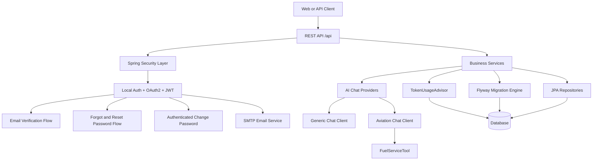

# AI Services Core


Enterprise-ready backend service for secure AI chat workflows with local and social authentication, email verification, password recovery flows, role/permission-based authorization, token usage audit reporting, and Flyway-based schema management.

## Table of Contents

1. [Overview](#overview)
2. [Capabilities](#capabilities)
3. [Architecture](#architecture)
4. [Technology Stack](#technology-stack)
5. [Authentication and Security](#authentication-and-security)
6. [AI Runtime](#ai-runtime)
7. [API Reference](#api-reference)
8. [Data and Migrations](#data-and-migrations)
9. [Configuration](#configuration)
10. [Observability](#observability)
11. [Production Hardening Checklist](#production-hardening-checklist)
12. [Known Gaps and Roadmap](#known-gaps-and-roadmap)

## Overview

This service is a Spring Boot 3 application that exposes AI chat and identity APIs under `/api`.

It supports:

- Local auth (`email + password`) and OAuth2 (Google, GitHub)
- Email verification and verification re-send
- Forgot/reset password and authenticated change-password flow
- Permission-gated chat modes (`generic`, `aviation`)
- Admin endpoints for user/permission management and AI token usage analytics
- Profile-based runtime (`dev` with H2, `prod` with PostgreSQL)
- Database schema management via Flyway

## Capabilities

### Identity and Access

- JWT access tokens with purpose-based claims
- Email verification token flow
- Password reset token flow with token reuse protection
- Account linking behavior for OAuth2 users based on provider/email resolution
- Role and permission model (`ROLE_USER`, `ROLE_ADMIN`, granular permissions)

### AI Chat

- Multi-provider architecture with chat-type registry
- Per-chat-type memory windows and isolated conversations
- Aviation mode with domain tool-calling support
- Token usage auditing (prompt/completion/total tokens, model, latency, cost)

### Operations

- Global API response wrapper for consistent contracts
- Centralized exception mapping
- Actuator endpoints for runtime health and diagnostics
- Docker multi-stage build

## Architecture



### Package Responsibilities

- `controller`: API endpoints for auth, me, chat, and admin use cases
- `security`: JWT filter, OAuth2 handlers, redirect URL builder, permission evaluator
- `service`: application business logic (auth, chat, audit, user management)
- `config`: security, CORS, async executors, AI clients, bootstrap wiring
- `provider` and `resolver`: chat provider registry and OAuth identity resolution
- `advisor`: AI usage auditing advisor
- `entity`, `repository`, `projection`: persistence model and read projections
- `advice` and `exception`: response wrapping and consistent error handling

## Technology Stack

- Java 21
- Spring Boot 3.5.13
- Spring Security (JWT + OAuth2 Client + method security)
- Spring Data JPA + Hibernate
- Spring AI 1.1.4
- Flyway
- H2 (dev profile)
- PostgreSQL (prod profile)
- SpringDoc OpenAPI / Swagger UI (dev profile)
- Spring Boot Actuator
- Maven
- Docker

## Authentication and Security

### Authentication Modes

- Local login and registration
- OAuth2 social login (`google`, `github`)

### JWT Purposes

Tokens carry a `purpose` claim and are validated by purpose:

- `ACCESS`
- `EMAIL_VERIFICATION`
- `PASSWORD_RESET`

Configured expirations (minutes):

- `access-expiration-in-minutes` (default 120)
- `email-verification-expiration-in-minutes` (default 30)
- `password-reset-expiration-in-minutes` (default 10)

### Verification and Password Flows

- **Register** creates user, sends verification email, and returns access token
- **Verify email** marks user as verified and stores `verifiedDate`
- **Resend verification** supports non-verified users
- **Forgot password** sends reset email for local accounts
- **Reset password** validates token purpose/expiry and blocks token reuse if already reset
- **Change password** requires authenticated user and validates current/new password rules

### Authorization

Security is enabled by default (`app.security.enabled=true`).

Protected endpoints use:

- Request matcher rules for admin APIs
- Method-level check for chat permission per `chatType`

Permissions currently include:

- Admin: `admin:read`, `admin:write`, `admin:delete`
- User: `user:read`, `user:write`, `user:delete`, `user:manage`
- Audit: `token:usage:read`
- Chat: `chat:generic:use`, `chat:aviation:use`

### CORS

CORS origins are externalized (`app.cors.allowed-origins`) and currently include local and deployed frontend origins.

## AI Runtime

### Chat Types

- `generic`
- `aviation`

### Chat Client Wiring

- Generic chat client:
  - Message window memory (max 10)
  - Token usage advisor enabled
- Aviation chat client:
  - System prompt from `src/main/resources/prompts/system-prompt.st`
  - Message window memory (max 10)
  - Token usage advisor enabled
  - `FuelServiceTool` registered for tool calls

### Conversation Scope

Conversation ID is resolved per authenticated user ID and can be cleared by chat type via API.

### Usage Auditing

Every AI call attempts asynchronous persistence of:

- User
- Model/provider
- Prompt/completion/total token counts
- Estimated cost
- Latency
- Input/output summaries

## API Reference

Base path: `/api`

### Auth

- `POST /auth/login`
- `POST /auth/register`
- `GET /auth/availability?email=...`
- `POST /auth/verify-email`
- `POST /auth/resend-verification`
- `POST /auth/forgot-password`
- `POST /auth/reset-password`

### OAuth2

- `GET /oauth2/providers`
- `GET /oauth2/{providerType}`

OAuth2 success/failure redirects go to frontend paths:

- `/oauth-success?token=...`
- `/oauth-error?message=...`

### Current User

- `GET /me`
- `POST /me/change-password`

### AI Chat

- `GET /ai/chat/types`
- `POST /ai/chat/{chatType}`
- `DELETE /ai/chat/{chatType}/conversation`

Example request body:

```json
{
  "message": "Summarize the latest fuel discrepancy report."
}
```

### Admin: Users

- `GET /admin/users`
- `GET /admin/users/{id}`
- `PATCH /admin/users/role/grant/{id}`
- `PATCH /admin/users/role/revoke/{id}`
- `PATCH /admin/users/permission/grant/{id}`
- `PATCH /admin/users/permission/revoke/{id}`
- `GET /admin/users/permission/available`

### Admin: Token Usage

- `GET /admin/token-usage?page=0&size=20`
- `GET /admin/token-usage/user/{userId}`
- `GET /admin/token-usage/date-range?startDate=...&endDate=...`
- `GET /admin/token-usage/total-tokens?startDate=...&endDate=...`
- `GET /admin/token-usage/total-tokens/user/{userId}?startDate=...&endDate=...`
- `GET /admin/token-usage/summary?startDate=...&endDate=...`

Date query parameters use ISO datetime format.

### API Response Contract

Responses are wrapped in:

```json
{
  "success": true,
  "message": "Success",
  "data": {},
  "error": null
}
```

Exceptions are normalized through global exception handling for validation, auth, authorization, JWT, AI provider, persistence, and fallback server errors.

## Data and Migrations

### Core Tables

- `app_user`
- `app_user_roles`
- `app_user_permissions`
- `token_usage_audit`

### Flyway

- Flyway is enabled in both `dev` and `prod`
- Migration scripts are under `src/main/resources/db/migration`
- Current schema baseline: `V1__init_schema.sql`

### Dev Seed Data Note

Dev seed data is wired for development testing.

- Seed script location: `src/main/resources/db/dev/V2__seed_data.sql`
- Active dev Flyway locations: `classpath:db/migration,classpath:db/dev`
- Intended usage: local/dev test bootstrap only

## Configuration

### Profiles

- `dev`
  - H2 file database
  - `ddl-auto=validate`
  - Flyway enabled, migration locations set to `classpath:db/migration,classpath:db/dev`
  - H2 console enabled at `/api/h2-console`
  - Swagger/OpenAPI enabled
- `prod`
  - PostgreSQL datasource from environment variables
  - `ddl-auto=validate`
  - Flyway enabled
  - Swagger/OpenAPI disabled

### Environment Variables

Required for core runtime:

- `OPENAI_API_KEY`
- `JWT_SECRET_KEY`
- `MAIL_USERNAME`
- `MAIL_PASSWORD`
- `GOOGLE_CLIENT_ID`
- `GOOGLE_CLIENT_SECRET`
- `GITHUB_CLIENT_ID`
- `GITHUB_CLIENT_SECRET`

Required for production datasource:

- `DATABASE_URL`
- `DATABASE_USERNAME`
- `DATABASE_PASSWORD`

Optional / operational:

- `PORT` (default `8080`)

Mandatory for bootstrap admin creation:

- `ADMIN_EMAIL`
- `ADMIN_PASSWORD`

### Bootstrap Admin

When `app.bootstrap.admin.enabled=true`, both `ADMIN_EMAIL` and `ADMIN_PASSWORD` are required to create the admin user at startup (if the user does not already exist).

## Observability

Actuator endpoints exposed via `/api/actuator` include:

- `health`
- `info`
- `metrics`
- `env`
- `loggers`
- `threaddump`

Swagger/OpenAPI in dev:

- `/api/v3/api-docs`
- `/api/swagger-ui.html`

## Production Hardening Checklist

- Use a strong managed JWT secret (prefer Base64-encoded key material)
- Restrict CORS origins to trusted frontend domains only
- Consider refresh-token strategy and token revocation/blacklisting
- Add rate limiting for auth and chat endpoints
- Replace in-memory chat memory for horizontal scale
- Reduce exposed actuator endpoints in internet-facing environments
- Enforce SMTP credentials and sender reputation controls
- Add API integration and security regression test coverage

## Known Gaps and Roadmap

- Aviation tool methods currently return mocked data
- Introduce a user access-request module where users can request feature permissions and admins can review/approve or reject those requests
- **Externalize config with refresh scope** - Integrate Spring Cloud Config Server for centralized configuration management with `@RefreshScope` support, enabling dynamic property updates without application restart (CORS origins, feature flags, AI model parameters, etc.)
- **Add redis** - Implement Redis caching layer for session storage, conversation memory, user preferences, and token blacklisting to reduce database load and improve response times for frequently accessed data
- **Add rate limiter** - Implement API rate limiting using Resilience4j or Spring Cloud Gateway to protect endpoints from abuse, with per-user and per-endpoint limits for auth, chat, and admin APIs
- **Add kafka for notification system** - Integrate Apache Kafka for asynchronous event-driven architecture to handle user notifications (token usage alerts, password reset confirmation, new feature announcements), decoupling notification producers from consumers for better scalability
- User Preferences/Settings - Store user preferences (model selection, temperature settings, etc.)
- Test coverage does not yet include full auth/chat/admin integration paths
