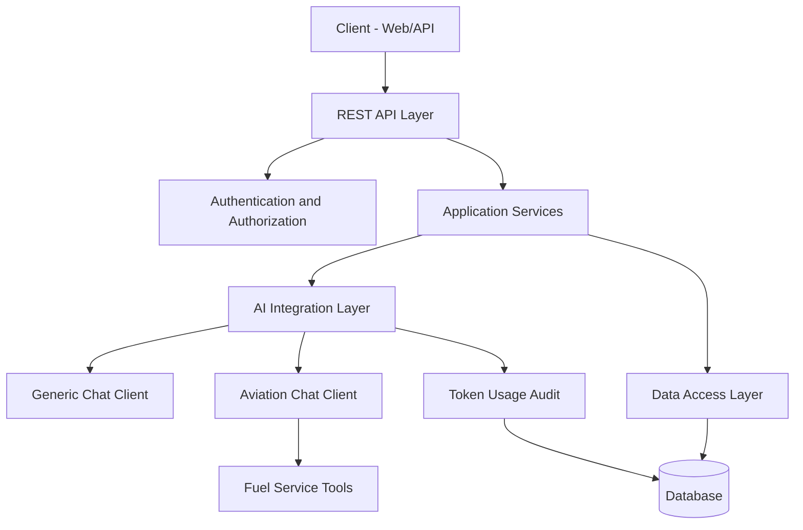

# AI Services Core

Backend platform for secure AI chat workflows with JWT and OAuth2 authentication, permission-based authorization, multi-mode chat execution, token usage auditing, and admin/observability endpoints.

## 1) Project Overview

This project is a Spring Boot 3 service designed for:

- local and social authentication (username/password, Google, GitHub)
- multi-mode AI chat with per-mode permissions
- aviation fuel discrepancy workflows backed by AI tools
- token usage auditing and admin reporting
- profile-based runtime setup for local development and production deployment

The current implementation exposes two chat modes:

- `generic`: a standard conversational chat client
- `aviation`: a domain-constrained chat client that uses the aviation system prompt and registered fuel tools

Each chat mode has its own conversation memory and access control.

## 2) Technology Stack

- Java 21
- Spring Boot 3.5.13
- Spring Security (JWT + OAuth2 client + method security)
- Spring Data JPA + Hibernate
- Spring AI 1.1.4
- PostgreSQL (production)
- H2 file database (development)
- SpringDoc OpenAPI / Swagger UI
- Spring Boot Actuator
- Maven + Docker multi-stage build

## 3) High-Level Architecture



### Package Responsibilities

- `controller`: REST endpoints for auth, current user, chat, and admin APIs
- `config` and `config/ai`: security, CORS, application beans, and per-chat-type AI wiring
- `service` and `service/impl`: business logic and chat orchestration
- `security`: JWT filter, OAuth handlers, redirect flow, and permission evaluation
- `provider` and `resolver`: OAuth provider-specific user extraction and account resolution
- `advisor`: Spring AI advisor for token usage tracking
- `tool`: AI-callable fuel domain tools
- `entity`, `repository`, `projection`: persistence layer
- `advice` and `exception`: response wrapping and exception mapping
- `properties`: configuration binding

## 4) Authentication and Authorization

### Authentication Modes

- `POST /api/auth/login`
- `POST /api/auth/register`
- `GET /api/auth/oauth2/{providerType}` for Google and GitHub login redirects

### JWT Model

JWT contains:

- `userId`
- `username`
- `provider`
- `authorities`

Token expiration is configured with `app.security.jwt.expiration-in-hours` and defaults to `2`.

### Authorization Model

The secured runtime is enabled by default with `app.security.enabled=true`. A permissive filter chain is available for local or test scenarios by setting `app.security.enabled=false`.

Current permission model includes:

- admin permissions: `admin:read`, `admin:write`, `admin:delete`
- user permissions: `user:read`, `user:write`, `user:delete`, `user:manage`
- token audit permission: `token:usage:read`
- chat permissions: `chat:generic:use`, `chat:aviation:use`

Examples enforced in configuration and controller method security:

- `GET /api/admin/token-usage/**` requires `token:usage:read`
- `GET /api/admin/users/**` requires `admin:read`
- `PATCH /api/admin/users/**` requires `admin:write`
- `POST /api/ai/chat/{chatType}` requires access to the requested chat type via `chatPermissionEvaluator`

## 5) AI and Tool Calling

### Chat Runtime

The application wires two independent `ChatClient` beans:

- generic chat client
  - uses message window memory
  - uses `TokenUsageAdvisor`
  - does not register domain tools
- aviation chat client
  - loads the system prompt from `src/main/resources/prompts/system-prompt.st`
  - uses message window memory
  - uses `TokenUsageAdvisor`
  - registers `FuelServiceTool`

### Model Provider

The default configuration uses an OpenAI-compatible provider through Spring AI:

- base URL: `https://api.pawan.krd`
- model: `openai/gpt-oss-20b`
- API key: `OPENAI_API_KEY`

These values come from `src/main/resources/application.yml` and can be overridden through normal Spring configuration.

### Conversation Memory

- repository: in-memory (`InMemoryChatMemoryRepository`)
- window size: `10` messages per chat type
- conversation lifecycle: maintained per authenticated user and can be cleared explicitly through the chat API

### Aviation Domain Tools

`FuelServiceTool` exposes the following AI-callable functions:

- `getBlockInFuel`
- `getFirstFuelSlip`
- `getInRangeRemainingFuel`
- `getAircraftLocation`
- `isWrongAircraft`
- `isMissingUpliftFuelSlip`
- `isMissingApuRunFuelSlip`
- `getAcarsFuelDetails`

Current tool implementations return mocked data. They are suitable for integration scaffolding, not production decisioning.

## 6) API Surface

Base path: `/api`

### Auth Endpoints

- `POST /api/auth/login`
- `POST /api/auth/register`
- `GET /api/auth/availability?username=...`
- `GET /api/auth/oauth2/providers`
- `GET /api/auth/oauth2/{providerType}`

### User Endpoint

- `GET /api/me`

### AI Chat Endpoints

- `GET /api/ai/chat/types`
- `POST /api/ai/chat/{chatType}`
- `DELETE /api/ai/chat/{chatType}/conversation`

Supported chat types currently returned by the service:

- `generic`
- `aviation`

Example request:

```json
{
  "message": "Hi, Tell me a joke!"
}
```

### Admin User Management

- `GET /api/admin/users`
- `GET /api/admin/users/{id}`
- `PATCH /api/admin/users/role/grant/{id}`
- `PATCH /api/admin/users/role/revoke/{id}`
- `PATCH /api/admin/users/permission/grant/{id}`
- `PATCH /api/admin/users/permission/revoke/{id}`
- `GET /api/admin/users/permission/available`

### Admin Token Usage Audit

- `GET /api/admin/token-usage?page=0&size=20`
- `GET /api/admin/token-usage/user/{userId}`
- `GET /api/admin/token-usage/date-range?startDate=...&endDate=...`
- `GET /api/admin/token-usage/total-tokens?startDate=...&endDate=...`
- `GET /api/admin/token-usage/total-tokens/user/{userId}?startDate=...&endDate=...`
- `GET /api/admin/token-usage/summary?startDate=...&endDate=...`

## 7) Response and Error Contract

Controller responses are wrapped under the configured global response wrapper for the application controller package:

```json
{
  "success": true,
  "message": "Success",
  "data": {},
  "error": null
}
```

Exception handling maps validation failures, authentication and authorization errors, JWT issues, AI provider failures, and generic server failures to a consistent API error payload.

## 8) Data Layer

### Core Entities

- `User`: identity, credentials, provider data, roles, permissions, timestamps
- `TokenUsageAudit`: provider/model metadata, token counts, cost estimate, latency, and request summaries

### Database Profiles

- `dev`: H2 file database with `ddl-auto=update`
- `prod`: PostgreSQL with `ddl-auto=validate`

## 9) Configuration Profiles

Main config files:

- `src/main/resources/application.yml`
- `src/main/resources/application-dev.yml`
- `src/main/resources/application-prod.yml`

### Required Environment Variables

- `OPENAI_API_KEY`
- `JWT_SECRET_KEY`
- `GOOGLE_CLIENT_ID`
- `GOOGLE_CLIENT_SECRET`
- `GITHUB_CLIENT_ID`
- `GITHUB_CLIENT_SECRET`

Production database variables:

- `DATABASE_URL`
- `DATABASE_USERNAME`
- `DATABASE_PASSWORD`

Optional runtime variables:

- `PORT` default `8080`

### Profile Notes

- `dev`
  - uses H2 at `jdbc:h2:file:~/testdb`
  - enables H2 console at `/api/h2-console`
  - leaves SQL seed init disabled with `spring.sql.init.mode=NEVER`
  - exposes Swagger UI and API docs through public endpoints
- `prod`
  - uses PostgreSQL
  - disables Swagger UI and OpenAPI docs
  - configures the production frontend origin

## 10) Observability and Operations

Actuator endpoints exposed by configuration:

- `/api/actuator/health`
- `/api/actuator/info`
- `/api/actuator/metrics`
- `/api/actuator/env`
- `/api/actuator/loggers`
- `/api/actuator/threaddump`

Swagger/OpenAPI endpoints in environments where they are enabled:

- `/api/v3/api-docs`
- `/api/swagger-ui.html`

## 11) Testing

The repository includes basic Spring Boot and model-level tests, but overall coverage is still light. The highest-value remaining gaps are chat authorization, token audit flows, OAuth success/failure handling, and controller-level integration tests.

## 12) Security Notes for Production

- use a strong JWT secret managed outside the repository
- tighten CORS policy as needed; allowed headers currently include `*`
- add token revocation or refresh-token flows if your client model requires them
- add request throttling for auth and chat endpoints
- replace in-memory chat memory if horizontal scaling or durable history is required

## 13) Seed Data

Sample SQL exists in `src/main/resources/sql/data.sql`.

Current `dev` profile does not auto-run that script because `spring.sql.init.mode=NEVER`. If you need seed data locally, import it manually or change the init mode for your environment.

## 14) Roadmap Recommendations

- replace mocked fuel tools with real upstream integrations
- persist chat memory to a database or distributed cache
- expand integration tests around security, admin flows, and chat permissions
- add end-to-end coverage for OAuth redirect and callback paths
- add additional chat modes only when backed by concrete permissions and runtime wiring

## 15) License and Ownership

No explicit license is currently declared in project metadata. Add a license file and complete the POM metadata before distributing the project externally.
