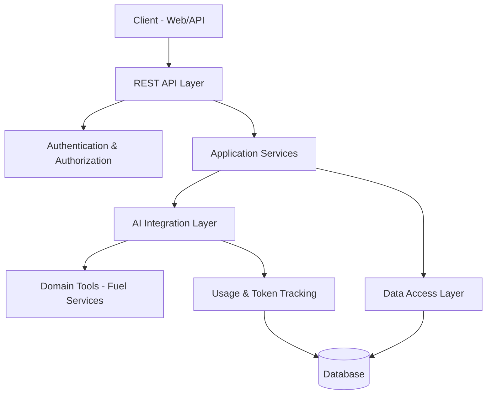

# AI Services Core

Backend platform for secure AI chat workflows in aviation operations. This service provides JWT and OAuth2 authentication, role and permission based authorization, AI chat with tool calling, token usage auditing, and operational endpoints for administration and observability.

## 1) Project Overview

This project is a Spring Boot 3 service designed for:

- secure user access (local login + Google/GitHub OAuth2)
- domain specific AI chat interactions focused on fueling discrepancy resolution
- auditability of AI token usage and cost
- admin level user and permission management

The AI assistant is currently configured for aviation fuel discrepancy analysis and can invoke backend tools during chat execution.
This project is in an initial stage and built for learning purposes, with planned feature expansion over time.

## 2) Technology Stack

- Java 21
- Spring Boot 3.5.13
- Spring Security (JWT + OAuth2 client)
- Spring Data JPA + Hibernate
- Spring AI 1.1.4
- PostgreSQL (production)
- H2 (development)
- SpringDoc OpenAPI / Swagger UI
- Actuator (health and metrics)
- Maven + Docker (multi stage build)

Key dependency definitions: `pom.xml`.

## 3) High-Level Architecture



### Package Responsibilities

- `controller`: REST API endpoints (`auth`, `ai/chat`, `me`, `admin`)
- `service` and `service/impl`: business logic
- `security`: JWT parsing/filtering, OAuth handlers, redirect flow
- `provider` and `resolver`: OAuth provider specific user extraction and account resolution
- `advisor`: Spring AI call advisor for token usage auditing
- `tool`: AI callable domain tools for aviation fuel checks
- `entity`, `repository`, `projection`: persistence and read models
- `advice`: global API response wrapping
- `exception`: centralized exception to HTTP mapping
- `config` and `properties`: bean setup and configuration binding

## 4) Authentication and Authorization

### Authentication Modes

- Local login with username/password (`POST /api/auth/login`)
- Local registration (`POST /api/auth/register`)
- OAuth2 login via Google and GitHub (`GET /api/auth/oauth2/{providerType}`)

### JWT Model

JWT contains:

- `userId`
- `username`
- `provider`
- `authorities` (roles + permissions)

Token expiration is controlled by:

- `app.security.jwt.expiration-in-hours` (default: `2`)

### Authorization Model

Role and permission model is enforced in security configuration:

- roles: `ROLE_USER`, `ROLE_ADMIN`
- permissions: `ADMIN_READ`, `ADMIN_WRITE`, `ADMIN_DELETE`, `USER_*`, `TOKEN_USAGE_READ`

Examples:

- `GET /api/admin/token-usage/**` requires `TOKEN_USAGE_READ`
- `GET /api/admin/users/**` requires `ADMIN_READ`
- `PATCH /api/admin/users/**` requires `ADMIN_WRITE`

## 5) AI and Tool Calling

### Chat Runtime

- `ChatClient` is configured with:
- system prompt from `src/main/resources/prompts/system-prompt.st`
- chat memory advisor
- token usage advisor
- domain tool registration (`FuelServiceTool`)

### Model Provider

- provider: OpenAI compatible endpoint
- base URL: `https://api.pawan.krd`
- model: `openai/gpt-oss-20b`

Configuration source: `src/main/resources/application.yml`.

### Conversation Memory

- memory repository: in-memory
- memory window: 10 messages
- conversation key: authenticated user id

### Domain Tools Exposed to AI

`FuelServiceTool` exposes callable functions such as:

- `getBlockInFuel`
- `getFirstFuelSlip`
- `getInRangeRemainingFuel`
- `getAircraftLocation`
- `isWrongAircraft`
- `isMissingUpliftFuelSlip`
- `isMissingApuRunFuelSlip`
- `getAcarsFuelDetails`

Note: current tool implementations return mocked values and should be integrated with real upstream systems for production use.

### Current Chat Scope

As of now, chat supports only fueling resolution and discrepancy workflows.
This behavior is intentionally constrained through the system prompt (`prompts/system-prompt.st`) and tool-driven logic.

Planned future enhancements include:

- general purpose chat interactions
- image generation
- text generation enhancements beyond current constrained workflow

## 6) API Surface

Base path:

- `/api`

### Auth Endpoints

- `POST /api/auth/login`
- `POST /api/auth/register`
- `GET /api/auth/availability?username=...`
- `GET /api/auth/oauth2/providers`
- `GET /api/auth/oauth2/{providerType}`

### User Endpoint

- `GET /api/me`

### AI Chat Endpoint

- `POST /api/ai/chat`

Request body:

```json
{
  "message": "Analyze aircraft N121FE fuel discrepancy"
}
```

### Admin User Management

- `GET /api/admin/users`
- `GET /api/admin/users/{id}`
- `PATCH /api/admin/users/role/grant/{id}`
- `PATCH /api/admin/users/role/revoke/{id}`
- `PATCH /api/admin/users/permission/grant/{id}`
- `PATCH /api/admin/users/permission/revoke/{id}`
- `GET /api/admin/users/permission/available`

### Admin Token Usage Audit

- `GET /api/admin/token-usage?page=0&size=20`
- `GET /api/admin/token-usage/user/{userId}`
- `GET /api/admin/token-usage/date-range?startDate=...&endDate=...`
- `GET /api/admin/token-usage/total-tokens?startDate=...&endDate=...`
- `GET /api/admin/token-usage/total-tokens/user/{userId}?startDate=...&endDate=...`
- `GET /api/admin/token-usage/summary?startDate=...&endDate=...`

## 7) Response and Error Contract

Global response wrapper returns:

```json
{
  "success": true,
  "message": "Success",
  "data": {},
  "error": null
}
```

Global exception handling maps major failures (validation, auth, access denied, JWT, AI provider failures, generic exceptions) to consistent API failure responses.

## 8) Data Layer

### Core Entities

- `User`: identity, credentials, provider info, roles, permissions, timestamps
- `TokenUsageAudit`: model/provider, prompt/completion/total token counts, estimated cost, latency, summaries

### Repositories

- `UserRepository`: user queries, role and permission mutation helpers
- `TokenUsageAuditRepository`: paged retrieval, user scoped retrieval, date range and aggregate summaries

### Database Profiles

- `dev`: H2 + `ddl-auto=update`
- `prod`: PostgreSQL + `ddl-auto=validate`

## 9) Configuration Profiles

Main config files:

- `src/main/resources/application.yml`
- `src/main/resources/application-dev.yml`
- `src/main/resources/application-prod.yml`

### Required Environment Variables

- `OPENAI_API_KEY`
- `JWT_SECRET_KEY`
- `GOOGLE_CLIENT_ID`
- `GOOGLE_CLIENT_SECRET`
- `GITHUB_CLIENT_ID`
- `GITHUB_CLIENT_SECRET`

Production database variables:

- `DATABASE_URL`
- `DATABASE_USERNAME`
- `DATABASE_PASSWORD`

Optional runtime:

- `PORT` (default `8080`)

## 10) Deployment

This service is deployed on Render.

Primary deployment target:

- Render (managed cloud deployment)

## 11) Observability and Operations

Actuator endpoints (profile and security settings apply):

- `/api/actuator/health`
- `/api/actuator/info`
- `/api/actuator/metrics`
- `/api/actuator/env`
- `/api/actuator/loggers`
- `/api/actuator/threaddump`

OpenAPI/Swagger:

- `/api/v3/api-docs`
- `/api/swagger-ui.html`

Note: API docs are disabled in production profile.

## 12) Testing

Test coverage is currently minimal and this project is still in an early learning stage.
Comprehensive test cases (unit, integration, and API security tests) are planned and will be added in upcoming iterations.

## 13) Security Notes for Production

- use a strong JWT secret from a secure secret manager
- prefer base64-decoded signing key strategy noted in `JwtService`
- tighten CORS headers (`allowedHeaders` currently accepts `*`)
- add refresh token and logout or revocation strategy if required by your threat model
- add request rate limiting for authentication and chat endpoints

## 14) Seed Data

Sample SQL exists at:

- `src/main/resources/sql/data.sql`

Important initialization requirement:

- create an admin user in the database during initial setup
- assign both roles: `ROLE_ADMIN` and `ROLE_USER`
- grant all permissions required for administration and user management

Current `dev` profile sets SQL init mode to `NEVER`, so seed inserts are not auto-applied unless configuration is changed or data is imported manually.

## 15) Roadmap Recommendations

- replace mock fuel tools with real data integrations
- add general purpose chat mode
- add image and richer text generation features
- persist chat memory to database or distributed cache
- expand integration tests for security and admin permissions
- add end-to-end tests for OAuth2 success/failure callback flows
- add API versioning strategy if external clients are expected

## 16) License and Ownership

No explicit license is currently declared in the project metadata. Add a license file and complete POM metadata (`licenses`, `developers`, `scm`) before open distribution.
